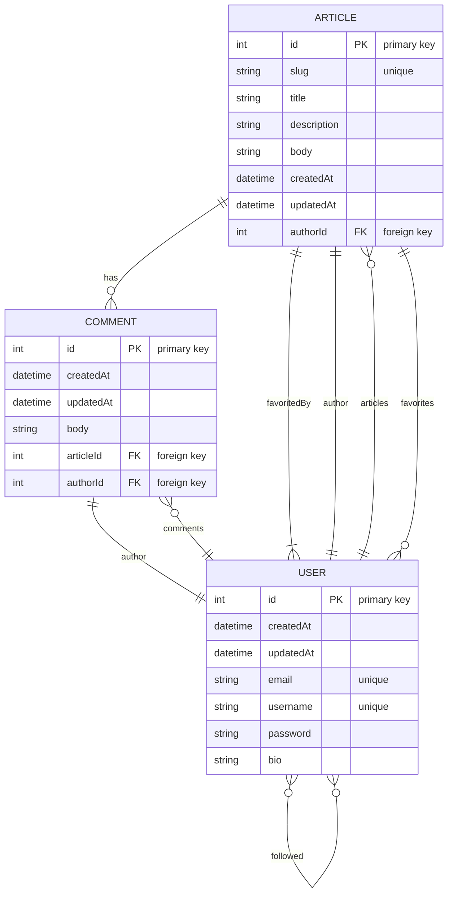

## Getting Started

### Prerequisites

Run the following command to install dependencies:

```shell
npm install
```

### Environment variables

This project operates using several environment variables. Should you choose to run this project on your local machine, make sure to establish a `.env` file at the base level of the directory to store these variables.

Here are the required ones:

```
DATABASE_URL=
JWT_SECRET=
NODE_ENV=development
```

### Generate your Prisma client

Run the following command to generate the Prisma Client which will include types based on your database schema:

```shell
npx prisma generate
```

### Apply any SQL migration script

Run the following command to create/update your database based on existing sql migration scripts:

```shell
npx prisma migrate deploy
```

### Run the project

Run the following command to run the project:

```shell
npx run start
```

### Seed the database

The project includes a seed script to populate the database:

```shell
npx prisma db seed
```

### Reset the database using migration

If you need to reset your database to a blank state and re-apply all migrations, run the following command:

```shell
npx prisma migrate reset
```

## ER Diagram


